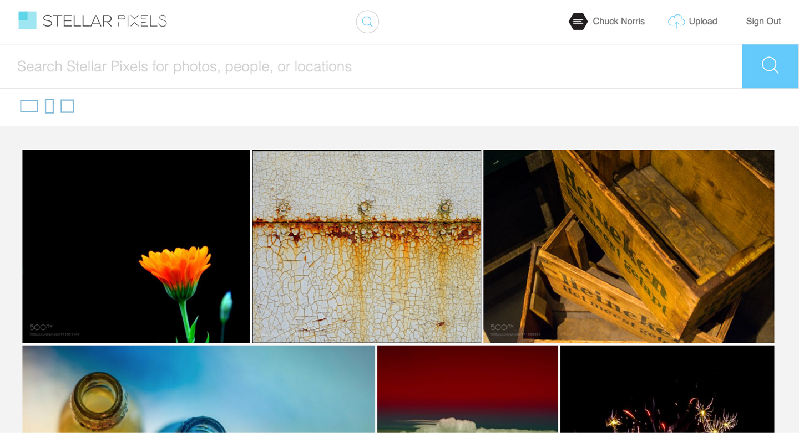

# README

## Background

Stellar Pixels is a full stack stock photography web application. The goal of Stellar Pixels was to create a stock photography website that would go the extra mile when it comes to search functionality. As an avid web designer, I have a lot of experience searching for photos on stock photography websites. The one thing that I believe could be done better by these companies is search functionality. Often times designers don't just want to search by keywords such as "snow" or "blue." Often times designers want to be able to find a photo by its aspect ratio... or whether it's flushed left or centered (just to name a few criteria).

I have not implemented much of this advanced search functionality yet, but I have devised a plan of how I will do this using tracking.js (a computer vision algorithyms library).


## Code

Stellar Pixels uses React with Redux on the frontend, alongside a Rails backend. The database is seeded with users (avatars from UIfaces and names from the Ruby Faker gem), and high quality photos of all types fetched from API requests to the 500px API. These requests are made using the Ruby HTTParty gem.

The frontend consists of Redux cycles that manage photo requests in different contexts such as news feed, search, and user profile.

Third party React components were used in order to achieve some more advanced functionality. For example, one common algorithym is used in photo sites to create what is most well known as the "Flickr image grid". This consists of photos organized in rows of different height, but which have equal widths and margins:



Using a third party solution seemed most appropriate to me here, so I found react-images "Gallery" to be the best solution to this problem for me:

```javascript
  return (
      <div className="search-results">
        <GalleryContainer photos={this.photos} disableLightbox={true} />
        <Waypoint
          onEnter={this._handleWaypointEnter}/>
        <section style={style} className="mod model-6">
          <div className="spinner">
          </div>
        </section>     
      </div>
  )
```

The code for this project was held to a high standard and is continuously being refactored according to best standards in React and Redux. More functionality (particularly relating to search) will be incorporated over time.
